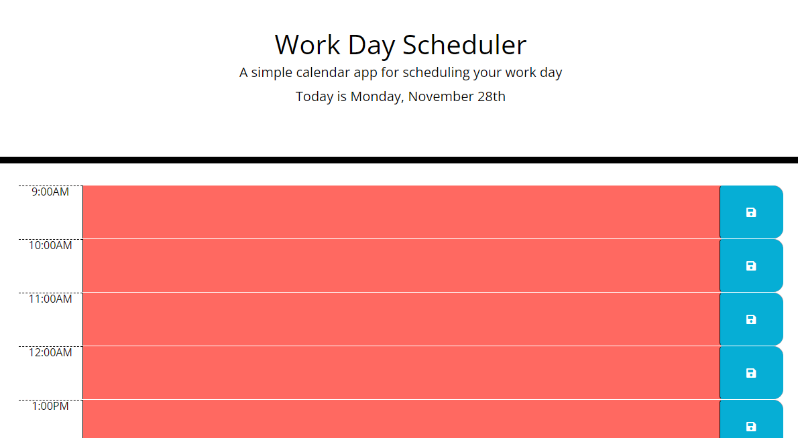

# Work-Day Scheduler

## Description

This application is designed to demonstrate my comprehension of local storage, JQuery, HTML, and JavaScript. Boot 'er up and check it out!

## Table of Contents

- [Deployed Application](#application)
- [Usage](#usage)
- [Credits](#credits)

## Application

[Deployed Scheduler]()

## Usage

Follow the application link above, type in an appointment you'd like to keep throughout your workday, save!

## Credits

[Kyle Larsen](https://github.com/kylelarsenlarsen)